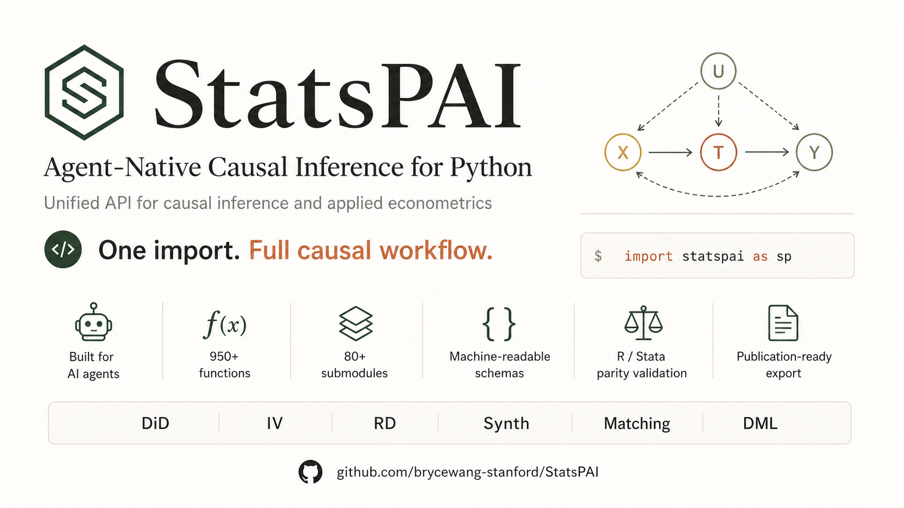

[English](https://github.com/brycewang-stanford/statspai/blob/main/README.md) | [中文](https://github.com/brycewang-stanford/statspai/blob/main/README_CN.md)

<p align="center">
  
</p>

# StatsPAI：面向 Agent 的因果推断与计量经济学 Python 工具包

[](https://pypi.org/project/StatsPAI/)
[](https://pypi.org/project/StatsPAI/)
[](https://github.com/brycewang-stanford/statspai/blob/main/LICENSE)
[](https://github.com/brycewang-stanford/statspai/actions)
[](https://pepy.tech/projects/statspai)
[](https://joss.theoj.org/papers/9f1c837b1b1df7adfcdd538c3698e332)
[](https://doi.org/10.5281/zenodo.19933900)

StatsPAI 是**首个面向 Agent 原生设计**的 Python 因果推断与应用计量经济学平台。一个 `import`，**950+ 个注册函数**，分布在 **80+ 个子模块**（实时数量请运行 `python scripts/registry_stats.py`），覆盖从经典计量经济学到前沿 ML/AI 因果推断方法，再到论文级 Word、Excel、LaTeX 输出表格的完整实证研究流程。

**为 AI Agent 而生**：每个函数都返回结构化结果对象，附带机器可读的 schema（`list_functions()`、`describe_function()`、`function_schema()`），并通过 R 与 Stata 参考实现进行数值对齐验证——专为 LLM 驱动的研究流程设计，同时对人类研究者也完全友好。

它将 R 的 [Causal Inference Task View](https://cran.r-project.org/web/views/CausalInference.html)（fixest、did、rdrobust、gsynth、DoubleML、MatchIt、CausalImpact、sfaR、lme4、oaxaca、ddecompose……）和 Stata 的核心计量命令（`frontier`、`xtfrontier`、`mixed`、`meglm`、`mixlogit`、`ivqreg`……），统一到一个一致的 Python API 中。

---

## 📊 因果推断覆盖一览

StatsPAI 聚焦**因果推断**——在这条主线上，我们的目标是成为任何语言里覆盖最完整的单个包。"Stata" = 官方 + 主要 SSC 包；"R" = CRAN；"sm+lm" = statsmodels + linearmodels。

| 方法家族                                                                 | Stata | R | sm+lm | DoubleML | **StatsPAI** |
| ------------------------------------------------------------------------ | :---: | :---: | :---: | :---: | :---: |
| DiD — 多期异质性（CS / SA / BJS / dCdH / Gardner / Wooldridge ET）+ 事件研究 + honest CIs | ⚠️ | ✅ | ❌ | ❌ | 🏆 |
| IV — 经典（2SLS/LIML/GMM）+ 现代（Kernel IV / Deep IV / KAN-DeepIV）    | ✅ 仅经典 | ✅ 仅经典 | ⚠️ 仅经典 | ⚠️ | 🏆 |
| RD — CCT + 2D / 边界 + 多断点 + honest CIs + ML-CATE（18+ 估计器）      | ⚠️ | ✅ (`rdrobust`) | ❌ | ❌ | 🏆 |
| 合成控制 — ADH / ASCM / gsynth / BSTS / Bayesian / PenSCM / FDID（20 种方法） | ⚠️ | ⚠️ (7 个包) | ❌ | ❌ | 🏆 |
| Double / Debiased ML                                                     | ❌    | ✅   | ❌    | ✅   | ✅ |
| Meta-Learners（S/T/X/R/DR）+ 因果森林 / GRF                              | ❌    | ✅   | ❌    | ❌   | ✅ |
| TMLE / HAL-TMLE                                                          | ❌    | ✅   | ❌    | ❌   | ✅ |
| 神经因果（TARNet / CFRNet / DragonNet）                                  | ❌    | ❌   | ❌    | ❌   | 🏆 |
| 因果发现（NOTEARS / PC / LiNGAM / GES）                                  | ❌    | ⚠️   | ❌    | ❌   | 🏆 |
| Proximal 因果推断（fortified / bidirectional / MTP / DNC）               | ❌    | ⚠️   | ❌    | ❌   | 🏆 |
| QTE / 分布处理效应 / CiC / dist-IV                                       | ⚠️    | ⚠️   | ❌    | ❌   | ✅ |
| Mendelian randomization（IVW/Egger/median/mode/PRESSO/MVMR/BMA）         | ❌    | ✅   | ❌    | ❌   | ✅ |
| Conformal 因果推断                                                       | ❌    | ❌   | ❌    | ❌   | 🏆 |
| 贝叶斯因果森林（BCF / 有序 / 因子暴露）                                  | ❌    | ⚠️   | ❌    | ❌   | ✅ |
| 空间计量（权重 → ESDA → ML/GMM → GWR/MGWR → 面板）                       | ❌    | ⚠️ (5 个包) | ❌ | ❌ | 🏆 |

**图例**：🏆 跨生态最完整 · ✅ 完整覆盖 · ⚠️ 部分 / 分散 / 单算法 · ❌ 无。

**StatsPAI 一句话概览**：live agent registry 中有 950+ 个注册函数 · 80+ 个子模块 · ~230k 行核心代码 + ~70k 行测试。这四个数字都可以由唯一的生成器 (`python scripts/registry_stats.py`) 现场复算；[`docs/stats.md`](docs/stats.md) 中的按模块拆分表也由同一个脚本回写。完整覆盖矩阵（23 个方法家族）以及跨生态行数对比，详见 [`docs/stats.md`](docs/stats.md)。

---

**📦 v1.15.1（2026-05-07）— RD 的 R 精确复现路径 + 负二项回归实现说明**

这是 v1.15.0 之后的 patch 发布准备版。`sp.rdrobust` 新增
`bwselect='cct'` 可选路径：需要和 R `rdrobust::rdrobust` 做 bit-equal
复现时，可以委托官方 `rdrobust>=1.3` Python 端完成带宽选择和稳健偏差
校正推断；默认 `bwselect='mserd'` 保持不变，所以既有 RD 脚本不会因为升
级而改变数字。安装精确复现路径：`pip install statspai[rd-cct]`。

本版也补齐负二项计数回归的实现说明。`sp.nbreg` 是 log-link MLE，默认
NB2（`Var[Y|X] = μ + αμ²`），也支持 `dispersion='constant'` 的 NB1
（`Var[Y|X] = μ(1 + δ)`）。拟合过程先用 Poisson IRLS 热启动，然后在
系数的 NB 加权 IRLS 和离散度参数的标量 profile likelihood 优化之间迭
代；支持 offset、exposure、weights、IRR、HC/cluster 标准误、相对
Poisson 的 LR 检验，以及 `y ~ x | id` 这种公式固定效应（通过显式 dummy
展开，适合中等规模面板）。`sp.xtnbreg(model='fe')` 包装这条固定效应
路径并默认按 entity 聚类；`model='re'` 分派到随机截距 NB2 GLMM
`sp.menbreg`。完整发布说明见 [`CHANGELOG.md`](CHANGELOG.md) `[1.15.1]`。

---

**📦 v1.13.1（2026-05-05）— 稳定性分级 + 外部效度档案 + 冷启动手术**

v1.13 给每个 `FunctionSpec` 打上 `stability` 标签
（`stable` / `experimental` / `deprecated`）以及函数级 `limitations`，
通过 `sp.describe_function` / `sp.list_functions(stability=...)` /
`statspai list` CLI / `sp.function_schema` 的 LLM 描述全链路曝光；
`sp.recommend` / `sp.causal` / `sp.paper` 默认丢弃 `experimental` /
`deprecated` 条目，除非显式传 `allow_experimental=True`。`aipw` /
`aggte` / `pretrends_test` / `sensitivity_rr` / `mccrary_test` /
`oster_bounds` / `wild_cluster_bootstrap` / `rd_honest` 这 8 个高频
估计器从 auto-registered 升级到 hand-written spec。`sp.preflight(...
"ivreg", formula=...)` 增加弱工具变量预检关，第一阶段 F 跌破
Staiger–Stock (1997) / Stock–Yogo (2005) 阈值时发结构化 warning；
`sp.recommend(... design='iv')` 在弱第一阶段下自适应把 LIML / AR 排到
2SLS 之前。同时新增 36 模块 R parity harness
（`tests/r_parity/`）、21 模块 Stata parity harness
（`tests/stata_parity/`）、4 数据集原始论文复算（Card / `mpdta` /
Basque / LaLonde NSW + PSID-1，全部 bit-equal 命中发表数字）、Track-C
性能 harness（HDFE / CS-DiD / SCM / DML 的 log-log 扩展）、
`tests/coverage_monte_carlo/` 上 B=1000 的 95% CI 实证覆盖
（OLS 0.952 / 2×2 DiD 0.955 / 强 IV 0.962，全部落在 99% Wilson 带
[0.935, 0.967] 内），以及 900 trial 的 CausalAgentBench 提示套件
（mock 模式已就绪，`--api` 一键开启）。新增三个顶层 meta API：
`sp.validation_report()` / `sp.coverage_matrix()` /
`sp.reproduce_jss_tables()` —— 让 referee 可以直接在 Python 里复核
StatsPAI 的外部效度证据，无需离开 REPL。冷启动方面，`statspai.forest`
改为惰性加载（Step 1B）、18 个估计器文件把 sklearn 移到函数体内
（Step 1C）、HAL TMLE 类去掉 sklearn 类继承（Step 1D），合计 `import
statspai` 的 sklearn 子模块数从 245 → **0**。`sp.callaway_santanna(method='reg')`
修复一个潜在的影响函数缩放错误（IPW / DR 路径不受影响）—— **请重跑
v1.10–v1.13 期间使用 `method='reg'` 的 CS-DiD 分析**。完整发布说明见
[`CHANGELOG.md`](CHANGELOG.md) `[1.13.1]`。

**📦 v1.12.2（2026-05-01）— `sp.causal_question` ML 路由 + 共享稳健性 battery + 加权 PLIV/IIVM**

v1.12.0 DML 加固之上的补丁版：`sp.causal_question` 现在直接接受
`design='dml'|'tmle'|'metalearner'|'causal_forest'` 标签并路由到对应
估计器，识别故事 / 假设也按设计正确记录；`sp.paper(...)` 两条入口共享
一份新的 design-aware 稳健性 battery（`workflow/_robustness.py`）；
`sp.llm_annotator_correct` 升级到多类处理 + 偏差校正自助 + SE 膨胀
诊断；`sp.dml(model='pliv'|'iivm')` 现已端到端支持 `sample_weight`。
对 v1.12.0/1.12.1 既有调用无任何数值变化。完整发布说明见
[`CHANGELOG.md`](CHANGELOG.md) `[1.12.2]`。

**📦 v1.12.0（2026-04-30）— DML 加固 + TMLE 正确性审计**

双线维护版本，完整发布说明见 [`CHANGELOG.md`](CHANGELOG.md) `[1.12.0]`，
破坏性变更迁移指引见 [`MIGRATION.md`](MIGRATION.md#v111--v112--dml-module-hardening).

- **⚠️ 正确性 — DML**：`sp.dml(model='irm' | 'iivm')` 改用
  `StratifiedKFold`（之前是 `KFold`）；子组为空的折现在抛
  `IdentificationFailure`，不再悄悄把 AIPW 分数填零。
  `sp.dml_panel(binary_treatment=True)` 改为已弃用的 no-op（旧
  路径在 within-demeaned 特征上拟合 raw {0,1} 标签，得到的倾向得分
  没有 `E[D̃|X̃]` 的清晰解释）。`sp.dml_model_averaging` 默认权重
  规则从 `"inverse_risk"` 切换为 `"short_stacking"`（Ahrens-Hansen-
  Schaffer-Wiemann 2025 *JAE* eq. 7）— 想保持 v1.11 的数字请显式传
  `weight_rule="inverse_risk"`。PLIV 弱工具变量 partial corr 阈值从
  `1e-6` 收紧到 `1e-3`，并增加了残差方差比守卫以捕获工具变量与 X
  完全共线的退化情形。
- **⚠️ 正确性 — TMLE**：`sp.tmle.SuperLearner` 现在解约束单纯形 QP
  （之前是 NNLS 加事后归一化，除非偶然，结果都不在单纯形上）。
  `sp.tmle.ltmle` 截尾半成品已修；`sp.tmle.ltmle_survival` 把 RMST
  和终止时刻 RD 的影响函数分开（之前两者共用一个非目标-函数化的
  EIF）。`sp.hal_tmle(variant='projection')` 现在诚实抛
  `NotImplementedError`，等 Riesz 投影步骤就位（之前是事后对 ε 做
  ad-hoc 收缩的 silent no-op）。
- **新增 — DML**：所有 `sp.dml(model=...)` 入口都接受 `random_state=`
  和 `sample_weight=`。`sample_weight=` 在 PLR / IRM / PLIV / IIVM /
  `sp.dml_panel` / `sp.dml_model_averaging` 上完全支持（统一走
  Z-estimator sandwich 方差）。每个变体的
  `model_info["diagnostics"]` 现在都填好了：倾向得分分布、clip 计数、
  子组兜底次数、partial corr、近似一阶段 F。

---

**🎉 v1.5.0 新版本 — Interference / Conformal / Mendelian 三家族合并升级**

StatsPAI 1.5.0 是 minor 版本，一次性完成 interference、conformal 因果推断、Mendelian 随机化三个家族的三项联动升级：完整家族文档指南、与 `sp.synth` / `sp.decompose` / `sp.dml` 同构的统一 dispatcher，以及一次针对性的正确性审计修掉两处"悄悄算错"。

| 模块 | v1.5 升级要点 |
| --- | --- |
| **家族指南（3 篇新）** | `docs/guides/interference_family.md` — 9 个估计器（`sp.spillover`、`sp.network_exposure`、`sp.peer_effects`、`sp.network_hte`、`sp.inward_outward_spillover`、`sp.cluster_matched_pair`、`sp.cluster_cross_interference`、`sp.cluster_staggered_rollout`、`sp.dnc_gnn_did`）+ 决策树 + 每次 interference 分析必报的 5 项诊断。`docs/guides/conformal_family.md` — 10 个 conformal 估计器按"边际覆盖保证的含义"重组，明确 marginal 与 conditional 的区别。`docs/guides/mendelian_family.md` — 17 个 MR 函数按 IV1 / IV2 / IV3 假设层级重组 + 4 项 sanity check + BMI → T2D 完整示例。 |
| **统一 dispatcher（3 个新）** | **`sp.mr(method=...)`** — 33 个别名（IVW / Egger / median / mode / MVMR / mediation / BMA / PRESSO / radial / Steiger / F 统计量 / LOO / 多效性 / 异质性）。**`sp.conformal(kind=...)`** — 29 个别名（CATE / counterfactual / ITE / density / 多阶段 / debiased-ML / fair / continuous / interference）。**`sp.interference(design=...)`** — 29 个别名（partial / network-exposure / peer-effects / network-HTE / inward-outward / 4 种 cluster-RCT 变体）。kwargs 原样透传；每个 dispatcher 的输出与直调结果逐字节一致（30 个新 parity 测试守卫）。 |
| **⚠️ 正确性修复 — `sp.mr_egger`** | slope 推断先前对 p 值和 CI 临界值都用 `stats.norm`，而配套的 `sp.mr_pleiotropy_egger` 用的是 `t(n−2)`，两处口径不一致。小样本下反而过松——`n_snps = 5`、`t ≈ 1.5` 时 Normal 给 `p = 0.134`，正确的 `t(3)` 给 `p = 0.231`。修复后两处都用 `t(n − 2)`；`n_snps ≥ ~100` 时数值不可见。回归守卫：`tests/test_correctness_v150.py::TestMREggerUsesTDistribution`。 |
| **⚠️ 正确性修复 — `sp.mr_presso`** | MC p 值（全局检验 + 逐 SNP outlier）先前都用原始 `mean(null ≥ obs)`，当实测统计量大于所有模拟 null 时会塌缩为 `0.0`。MC 估计 p 值的真实下界是 `1 / (B + 1)`，不可能为零。修复改用标准 `(k + 1) / (B + 1)`（与 R 的 MR-PRESSO 一致）。`log(p)` 和灵敏度变换不会再静默返回 `-inf`。回归守卫：`tests/test_correctness_v150.py::TestMRPressoMCPvalueConvention`。 |
| **⚠️ 破坏性变更 — `sp.mr`** | 模块别名 → 函数 dispatcher。v1.5.0 之前 `sp.mr.mr_ivw(...)` 能走通是因为 `sp.mr` 是 `statspai.mendelian` 的模块别名。迁移：用顶层 `sp.mr_ivw(...)`（历来就有，未变）或新的 `sp.mr("ivw", ...)`。模块访问保留在 `sp.mendelian` 下。见 [MIGRATION.md](MIGRATION.md#v14x--v150)。 |
| **Registry 覆盖** | 5 个此前"sp 命名空间可见但 registry 没挂"的家族函数现已出现在 `sp.list_functions()` 并可通过 `sp.describe_function()` 拿到 agent 可读 schema：`network_exposure`、`peer_effects`、`weighted_conformal_prediction`、`conformal_counterfactual`、`conformal_ite_interval`。 |

除了 `sp.mr` 模块→函数这一点，其他所有公开签名与 v1.4.2 逐字节一致。

**v1.4.2 — 正确性补丁 + Proximal / QTE / 因果 RL 家族指南**

StatsPAI 1.4.2 是 patch 版本，带两个"悄悄算错"的修复 + 三篇家族指南：

- **⚠️ 正确性修复 — `sp.dml_model_averaging` 的 √n SE 尺度 bug**：候选间方差聚合器把"样本均值影响函数的外积"当成了 `Var(θ̂_avg)` 本身，漏掉了最后的 `/ n`。报告的 SE 因此比真值大 `√n` 倍；在典型 n=400 DGP 上，95% CI 宽度 4.20（理论 ≈ 0.21），实证覆盖率 100%（名义 95%）。修复后 CI 宽度 0.21，覆盖率回到名义水平。回归守卫加在 `tests/test_dml_model_averaging.py::test_se_on_correct_scale`。
- **⚠️ 正确性修复 — `sp.gardner_did` event-study 参照组污染**：Stage-2 dummy 回归把"从未处理单元"和"处在 event-study 视野之外的已处理单元"合并成同一个基线，把每个 event-time 系数都往这个混合基线的均值拖。τ=2 且严格平行趋势的合成面板上，pre-trend ≈ -0.30（应为 0），post ≈ +1.72（应为 2.0）。Event-study 模式下改用 Borusyak-Jaravel-Spiess 风格的 (cohort × relative-time) 分箱直接聚合 imputed gap。修复后 pre-trend ≈ +0.01，post ≈ +2.02。非 event-study 的单 ATT 路径本来就对，保持不变。
- **家族指南**：`docs/guides/proximal_family.md`（Proximal 家族）、`docs/guides/qte_family.md`（均值→分位数→分布）、`docs/guides/causal_rl_family.md`（因果 RL）。
- **v1.4.1 cherry-pick 的正式发版**：`tests/test_bridge_full.py` + `docs/guides/bridging_theorems.md`。

**v1.4.1 — v3 前沿 Sprint 3：AKM 冲击聚类 SE、Claude 扩展思考、对齐与集成测试套件、2 篇新指南**

StatsPAI 1.4.1 在 1.4.0 基础上做增量更新，关闭 Sprint 3 的 4 项工作：

- **AKM 冲击聚类 SE**：`sp.shift_share_political_panel(cluster='shock')` 实现 Park-Xu（2026）§4.2 推荐的 Adão-Kolesár-Morales（2019）面板扩展方差估计，在 10–100 个行业的设定下通常比单元聚类 SE 紧 3×。`diagnostics['akm_se']` 与可读 `diagnostics['cluster']` 标签同时返回。
- **Causal MAS 的 Claude 扩展思考**：`sp.causal_llm.anthropic_client(thinking_budget=N)` 接入 Claude 4.5 / Opus 4.7 扩展思考 API。推理轨迹写入 `client.history[-1]['thinking']` 以便审计，但不会出现在 `causal_mas` 解析的正文里。同时处理 `thinking` 与 `redacted_thinking` 两类 content block。
- **对齐与集成测试套件**：`tests/reference_parity/test_assimilation_parity.py`（10 项 Kalman / 粒子后端校验，含 Kalman↔粒子一致性与 Student-t 污染鲁棒性）与 `tests/integration/test_causal_mas_with_fake_llm.py`（11 个基于 `echo_client` 的 MAS 端到端测试 + 3 个 mock Anthropic SDK 的 Claude thinking block 解析测试）。
- **两篇新 MkDocs 指南**：`docs/guides/shift_share_political_panel.md`（含 AKM 冲击聚类的完整面板 IV 流程）与 `docs/guides/causal_mas.md`（多智能体 LLM 因果发现完整走查）。

v1.4.0 的所有公开 API 保持稳定；新增面只是附加 kwargs。

**v1.4.0 — v3 前沿 Sprint 2：面板 shift-share、真·LLM 适配器、粒子滤波同化、3 篇新指南**

StatsPAI 1.4.0 是知识地图 v3 路线图的 Sprint 2，关闭了 Sprint 1 末尾的 4 个次要项：Park-Xu 政治 shift-share 多期扩展、Causal MAS 发现 Agent 的真·OpenAI/Anthropic 适配器、`causal_kalman` 的粒子滤波后端（处理非高斯先验与非线性动力学），以及 3 篇覆盖 v3 前沿的 MkDocs 指南。Sprint 1 模块的 20 处 unused-import 清理。CI 上 1 个 CausalForest ATE parity 测试的 flake 通过显式播种修复。

| 模块 | v1.4 亮点 |
| --- | --- |
| **面板 shift-share IV** | **`sp.shift_share_political_panel`** — Park-Xu（2026）§4.2 多期扩展：时变 shares + 时变 shocks、单元/时间/双向 FE 池化 2SLS、按期 event-study 表 + 总体 Rotemberg top-K。30×4 合成面板上恢复 τ = 0.30 误差 0.003。 |
| **真·LLM 适配器（Causal MAS）** | **`sp.causal_llm.openai_client`** — OpenAI SDK ≥ 1.0（通过 `base_url` 支持 Azure / vLLM / Ollama）。**`sp.causal_llm.anthropic_client`** — Anthropic Messages API ≥ 0.30，默认 `claude-opus-4-7`。**`sp.causal_llm.echo_client`** — 离线单测用的确定性脚本客户端。SDK lazy-import → 核心包零新增运行时依赖。 |
| **粒子滤波同化** | **`sp.assimilation.particle_filter`** — 带系统重采样的 bootstrap-SIR 粒子滤波（Gordon-Salmond-Smith 1993；Douc-Cappé 2005）。非高斯先验、重尾观测噪声、非线性动力学通过可插拔回调实现。高斯 DGP 下与精确 Kalman 一致到 ~0.003。**`sp.assimilative_causal(..., backend='particle')`** 端到端 wrapper 路由到粒子滤波。 |
| **文档（v3 前沿指南）** | `docs/guides/synth_experimental.md`（Abadie-Zhao 反向 SC 流程）、`docs/guides/harvest_did.md`（Borusyak-Hull-Jaravel harvest DID）、`docs/guides/assimilative_ci.md`（Nature Comms 2026 流式 CI，Kalman + 粒子后端）。已挂到 `mkdocs.yml` 导航。 |
| **v1.3 稳定基础（延续）** | Sprint 1 的 11 个 2025-2026 前沿方法：`synth_experimental_design`、`rdrobust(..., bootstrap='rbc')`、`evidence_without_injustice`、`target_trial.to_paper(fmt='jama'/'bmj')`、`harvest_did`、`bcf_ordinal`、`bcf_factor_exposure`、`causal_mas`、`shift_share_political`、`causal_kalman`。所有 v1.0 capstone 面（`sp.bridge`、`sp.fairness`、`sp.surrogate`、`sp.epi`、`sp.longitudinal`、`sp.question`、MR 全家桶、TARGET 清单）保持不变。 |
| **Agent 平台** | `sp.list_functions()` / `sp.describe_function()` / `sp.function_schema()` 为 874+ 估计量提供 OpenAI/Anthropic tool-calling schema。本版本新增 5 个手工 `FunctionSpec`。`sp.agent.mcp_server` MCP 脚手架让外部 LLM 可自然语言调用每个函数。 |
| **CI/CD 卫生** | v1.3.0 的 `tabulate` 硬依赖延续。通过显式播种（`random_state=0`、`n_estimators=300`、扩 `n`）修复 `test_forest_ate_recovers_average_tau` flake。2 699+ 测试在所有 OS × Python matrix 上通过。 |

**v0.6 新功能**：`sp.interactive(fig)` —— 类似 Stata Graph Editor 的 WYSIWYG 图表编辑器，支持 29 种学术主题、实时预览、自动生成可复现代码。


> 由 [CoPaper.AI](https://copaper.ai) 团队构建 · 斯坦福 REAP 项目

---

## 为什么选择 StatsPAI？

| 痛点 | Stata | R | StatsPAI |
| --- | --- | --- | --- |
| 包分散 | 统一环境，但 $695+/年 | 20+ 个包，API 互不兼容 | **一个 `import`，统一 API** |
| 论文表格 | `outreg2`（格式有限） | `modelsummary`（最佳） | **每个函数都支持 Word + Excel + LaTeX + HTML** |
| 稳健性检验 | 手动重跑 | 手动重跑 | **`spec_curve()` + `robustness_report()` —— 一行代码** |
| 异质性分析 | 手动分组 + 画图 | 手动 `lapply` + `ggplot` | **`subgroup_analysis()` 含 Wald 检验** |
| 现代 ML 因果 | 有限（无 DML、无因果森林） | 分散（DoubleML、grf、SuperLearner 各自独立） | **DML、因果森林、Meta-Learners、TMLE、DeepIV** |
| 神经因果模型 | 无 | 无 | **TARNet、CFRNet、DragonNet** |
| 加速后端 | CPU / Stata/MP 多核为主 | GPU 支持分散在不同包里 | **同一计量 API 下 opt-in JAX / PyTorch 后端** |
| 因果发现 | 无 | `pcalg`（API 复杂） | **`notears()`、`pc_algorithm()`** |
| 策略学习 | 无 | `policytree`（独立包） | **`policy_tree()` + `policy_value()`** |
| 结果对象 | 命令间不统一 | 包间不统一 | **统一的 `CausalResult`：`.summary()`、`.plot()`、`.to_latex()`、`.cite()`** |
| 交互式图表编辑 | Graph Editor（无法导出代码） | 无 | **`sp.interactive()` —— GUI 编辑 + 自动生成代码** |

---

## StatsPAI 是什么，不是什么

StatsPAI **不是** R 的 wrapper。我们从原始论文独立重新实现每一个算法（通过 `.cite()` 暴露引用），少数成熟引擎（pyfixest、rdrobust）使用显式透明的绑定。StatsPAI 的真正差异化在于**上层的统一架构**：

- **一个结果对象，一套 API。** 从 `regress()` 到 `callaway_santanna()` 到 `causal_forest()` 到 `notears()`，所有估计器返回同样的 `CausalResult`，共享 `.summary()` / `.plot()` / `.to_latex()` / `.cite()` 接口。R 用户要记 20+ 个互不兼容的 S3 类，StatsPAI 用户只需要记一个。
- **单个 R / Python 包无法企及的广度。** DID + RD + Synth + Matching + DML + Meta-learners + TMLE + Neural Causal + Causal Discovery + Policy Learning + Conformal + Bunching + Spillover + Matrix Completion —— 全部风格统一，全部在 `sp.*` 命名空间下。
- **Agent-native 原生设计。** 自描述 schema（`list_functions()`、`describe_function()`、`function_schema()`）让 StatsPAI 成为**首个为 LLM 驱动研究工作流而构建**的计量工具包——任何语言的包都没有这个能力。
- **选择性 accelerator-ready。** 神经因果估计器可以通过 `STATSPAI_TORCH_DEVICE` 显式路由到 PyTorch CUDA/MPS，HDFE residualizer 暴露 `backend="jax"`。这不是“全包 GPU 加速”或“已经全面快过 R/Stata”的声明；GPU 性能需要单独在对应硬件上报告。
- **论文级输出流水线开箱即用。** 每个估计器都直接支持 Word + Excel + LaTeX + HTML + Markdown 导出，不需要额外跳一段 `modelsummary` 风格的舞。

**原则**：R 里有的方法，我们在 Python 里做到同等或更强的功能覆盖；然后叠加 Python 独有的优势——sklearn 生态集成、opt-in JAX / PyTorch accelerator 后端、agent-native schema。

---

## 完整功能列表

### 回归模型

| 函数 | 描述 | Stata 等价命令 | R 等价函数 |
| --- | --- | --- | --- |
| `regress()` | OLS，支持稳健/聚类/HAC 标准误 | `reg y x, r` / `vce(cluster c)` | `fixest::feols()` |
| `ivreg()` | IV / 2SLS，含一阶段诊断 | `ivregress 2sls` | `fixest::feols()` + IV |
| `panel()` | 固定效应、随机效应、Between、一阶差分 | `xtreg, fe` / `xtreg, re` | `plm::plm()` |
| `heckman()` | Heckman 选择模型 | `heckman` | `sampleSelection::selection()` |
| `qreg()`, `sqreg()` | 分位数回归 | `qreg` / `sqreg` | `quantreg::rq()` |
| `tobit()` | 截断回归（Tobit） | `tobit` | `censReg::censReg()` |
| `xtabond()` | Arellano-Bond 动态面板 GMM | `xtabond` | `plm::pgmm()` |
| `glm()` | 广义线性模型（6 族 × 8 链接） | `glm` | `stats::glm()` |
| `logit()`, `probit()` | 二元选择模型，含边际效应 | `logit` / `probit` | `stats::glm(family=binomial)` |
| `mlogit()` | 多项 Logit | `mlogit` | `nnet::multinom()` |
| `ologit()`, `oprobit()` | 有序 Logit / Probit | `ologit` / `oprobit` | `MASS::polr()` |
| `poisson()`, `nbreg()` | 计数模型；`nbreg` 支持 NB2/NB1、offset/exposure、IRR、稳健/聚类标准误、显式公式固定效应 | `poisson` / `nbreg` | `MASS::glm.nb()` |
| `xtnbreg()` | 面板负二项回归（`fe` 走显式 dummy 固定效应，`re` 走随机截距 NB2 GLMM） | `xtnbreg, fe` / `xtnbreg, re` | `glmmTMB` / `lme4` 风格 NB GLMM |
| `ppmlhdfe()` | 引力模型伪泊松 MLE | `ppmlhdfe` | `fixest::fepois()` |
| `feols()` | OLS / IV，高维固定效应（pyfixest 后端） | `reghdfe` | `fixest::feols()` |
| `fepois()` | 高维固定效应泊松 | `ppmlhdfe` | `fixest::fepois()` |
| `feglm()` | 高维固定效应 GLM | — | `fixest::feglm()` |
| `etable()` | 出版级回归表（LaTeX / Markdown / HTML） | `esttab` | `fixest::etable()` |
| `gmm()` | 一般 GMM（任意矩条件） | `gmm` | `gmm::gmm()` |
| `frontier()` | 随机前沿分析 | `frontier` | `sfa::sfa()` |

### 因果推断 — 双重差分

| 函数 | 描述 | 参考文献 |
| --- | --- | --- |
| `did()` | 自动分派 DID（2×2 或交错） | — |
| `did_summary()` | 一次调用跑 CS/SA/BJS/ETWFE/Stacked 五种方法并出对比表 | — |
| `did_summary_plot()` | 方法稳健性森林图（点估计 + CI 并排） | — |
| `did_summary_to_markdown()` / `_to_latex()` | 论文级稳健性对比表（GFM / booktabs） | — |
| `did_report()` | 一次调用打包输出：txt + md + tex + png + json | — |
| `callaway_santanna()` | 交错 DID，异质处理效应 | Callaway & Sant'Anna (2021) |
| `sun_abraham()` | 交互加权事件研究 | Sun & Abraham (2021) |
| `bacon_decomposition()` | TWFE 分解诊断 | Goodman-Bacon (2021) |
| `honest_did()` | 平行趋势假设敏感性 | Rambachan & Roth (2023) |
| `continuous_did()` | 连续处理 DID（剂量反应） | Callaway, Goodman-Bacon & Sant'Anna (2024) |
| `did_imputation()` | 插补 DID 估计量 | Borusyak, Jaravel & Spiess (2024) |
| `wooldridge_did()` / `etwfe()` | 扩展 TWFE：`xvar=`（单/多协变量异质性）+ `panel=`（重复截面）+ `cgroup=`（never/notyet 控制组） | Wooldridge (2021) |
| `etwfe_emfx()` | R `etwfe::emfx` 等价——simple/group/event/calendar 四种聚合边际效应 | McDermott (2023) |
| `drdid()` | 2×2 双重稳健 DID（OR + IPW） | Sant'Anna & Zhao (2020) |
| `stacked_did()` | 堆叠事件研究 DID | Cengiz et al. (2019); Baker, Larcker & Wang (2022) |
| `ddd()` | 三重差分（DDD） | Gruber (1994); Olden & Møen (2022) |
| `cic()` | Changes-in-changes 分位 DID | Athey & Imbens (2006) |
| `twfe_decomposition()` | Bacon + de Chaisemartin–D'Haultfoeuille 权重诊断 | Goodman-Bacon (2021); dCDH (2020) |

### 因果推断 — 断点回归

| 函数 | 描述 | 参考文献 |
| --- | --- | --- |
| `rdrobust()` | 尖锐/模糊 RD，稳健偏差校正推断 | Calonico, Cattaneo & Titiunik (2014) |
| `rdplot()` | RD 可视化（分箱散点图） | — |
| `rddensity()` | McCrary 密度操纵检验 | McCrary (2008) |

### 因果推断 — 匹配与再加权

| 函数 | 描述 | Stata 等价命令 |
| --- | --- | --- |
| `match()` | PSM、Mahalanobis、CEM，含平衡诊断 | `psmatch2` / `cem` |
| `ebalance()` | 熵平衡 | `ebalance` |

### 因果推断 — 合成控制

| 函数 | 描述 | 参考文献 |
| --- | --- | --- |
| `synth()` | Abadie-Diamond-Hainmueller SCM | Abadie et al. (2010) |
| `sdid()` | 合成双重差分 | Arkhangelsky et al. (2021) |

### 机器学习因果推断

| 函数 | 描述 | 参考文献 |
| --- | --- | --- |
| `dml()` | 双重/去偏 ML（PLR + IRM），交叉拟合 | Chernozhukov et al. (2018) |
| `causal_forest()` | 因果森林，异质处理效应 | Wager & Athey (2018) |
| `deepiv()` | 深度 IV 神经网络方法 | Hartford et al. (2017) |
| `metalearner()` | S/T/X/R/DR-Learner CATE 估计 | Kunzel et al. (2019), Kennedy (2023) |
| `tmle()` | 目标最大似然估计 | van der Laan & Rose (2011) |

### 神经因果模型

| 函数 | 描述 | 参考文献 |
| --- | --- | --- |
| `tarnet()` | Treatment-Agnostic 表示网络 | Shalit et al. (2017) |
| `cfrnet()` | 反事实回归网络 | Shalit et al. (2017) |
| `dragonnet()` | Dragon 神经网络 CATE | Shi et al. (2019) |

### 估计后命令

| 函数 | 描述 | Stata 等价命令 |
| --- | --- | --- |
| `margins()` | 平均边际效应（AME/MEM） | `margins, dydx(*)` |
| `test()` | 线性约束 Wald 检验 | `test x1 = x2` |
| `lincom()` | 线性组合推断 | `lincom x1 + x2` |
| `estat()` | 综合估计后诊断 | `estat` |
| `predict()` | 样本内/外预测 | `predict` |

### 诊断与敏感性分析

| 函数 | 描述 | 参考文献 |
| --- | --- | --- |
| `oster_bounds()` | 系数稳定性界限 | Oster (2019) |
| `sensemakr()` | 遗漏变量敏感性 | Cinelli & Hazlett (2020) |
| `evalue()` | E-值（未测量混杂敏感性） | VanderWeele & Ding (2017) |
| `vif()` | 方差膨胀因子 | — |
| `het_test()` | Breusch-Pagan / White 异方差检验 | — |
| `reset_test()` | Ramsey RESET 设定检验 | — |

### 智能工作流引擎 *(StatsPAI 独有 — 其他工具包没有这些功能)*

| 函数 | 描述 |
| --- | --- |
| `recommend()` | 给定数据 + 研究问题 → 推荐估计方法，附推理过程，可直接 `.run()` |
| `compare_estimators()` | 多方法对比（OLS、匹配、IPW、DML……），报告一致性诊断 |
| `assumption_audit()` | 一键检验任何方法的所有假设，每项给出通过/失败/补救方案 |
| `sensitivity_dashboard()` | 多维度敏感性分析（样本、异常值、不可观测变量），含稳定性评级 |
| `pub_ready()` | 期刊专属发表准备清单（Top 5 经济学、AEJ、RCT） |
| `replicate()` | 内置经典数据集（Card 1995、LaLonde 1986、Lee 2008），含复现指南 |

### 稳健性分析 *(StatsPAI 独有)*

| 函数 | 描述 |
| --- | --- |
| `spec_curve()` | 规格曲线 / 多元宇宙分析 |
| `robustness_report()` | 自动稳健性电池（标准误变体、缩尾、截断、增减控制变量、子样本） |
| `subgroup_analysis()` | 异质性分析 + 森林图 + 交互 Wald 检验 |

### 论文级输出

| 函数 | 描述 | 格式 |
| --- | --- | --- |
| `modelsummary()` | 多模型对比表 | 文本、LaTeX、HTML、Word、Excel |
| `outreg2()` | Stata 风格回归表导出 | Excel、LaTeX、Word |
| `sumstats()` | 描述性统计（Table 1） | 文本、LaTeX、HTML、Word、Excel |
| `balance_table()` | 处理前平衡检验 | 文本、LaTeX、HTML、Word、Excel |
| `coefplot()` | 系数森林图 | matplotlib |
| `binscatter()` | 分箱散点图（可残差化） | matplotlib |
| `interactive()` | WYSIWYG 图表编辑器，29 种主题 + 自动生成代码 | Jupyter ipywidgets |

每个结果对象都有：

```python
result.summary()      # 格式化文本摘要
result.plot()         # 合适的可视化图表
result.to_latex()     # LaTeX 表格
result.to_docx()      # Word 文档
result.cite()         # 方法的 BibTeX 引用
```

### 交互式图表编辑器 — Python 版 Stata Graph Editor

用过 Stata 的人都知道 Graph Editor——双击图表就能进入可视化编辑界面，拖字体、换颜色、调布局，所见即所得。Python 这边，matplotlib 画完图想改标题字号得回去改代码重跑。

**`sp.interactive(fig)`** 把任何 matplotlib 图表变成带实时预览的编辑面板——左边是图表，右边是属性控制，跟 Stata Graph Editor 一样的操作逻辑。但它比 Stata 多做了两件事：

1. **29 种学术主题一键切换。** 从 AER 期刊风格到 ggplot、FiveThirtyEight、暗色演示模式，选一下就能看到效果。Stata 换 scheme 要重新出图，这里是实时的。

2. **每一步编辑自动生成可复现代码。** 你在 GUI 里调了标题字号、换了颜色、加了注释，编辑器会把操作记录成标准 matplotlib 代码。一键复制，贴到脚本里就能复现。Stata Graph Editor 无法导出编辑操作为 do-file 命令。

```python
import statspai as sp

result = sp.did(df, y='wage', treat='policy', time='year')
fig, ax = result.plot()
editor = sp.interactive(fig)   # 打开编辑器

# 在 GUI 中编辑后：
editor.copy_code()             # 打印可复现的 Python 代码
```

---

## 安装

```bash
pip install statspai
```

可选依赖：

```bash
pip install statspai[plotting]    # matplotlib, seaborn
pip install statspai[fixest]      # pyfixest 高维固定效应
pip install statspai[deepiv]      # PyTorch (Deep IV)
pip install statspai[neural]      # PyTorch (TARNet / CFRNet / DragonNet)
pip install statspai[performance] # JAX CPU 后端，用于 sp.fast.demean
```

加速后端默认不自动开启。神经估计器默认使用 CPU；安装匹配的 PyTorch 后，可以设置
`STATSPAI_TORCH_DEVICE=auto`、`cuda` 或 `mps`。HDFE 的 JAX 路径需要显式传入
`sp.fast.demean(..., backend="jax")`；CUDA JAX 还需要用户安装 CUDA-enabled JAX。

**环境要求：** Python >= 3.9

**核心依赖：** NumPy、SciPy、Pandas、statsmodels、scikit-learn、linearmodels、patsy、openpyxl、python-docx

---

## 快速示例

以下所有代码均可直接运行 —— 仅使用 StatsPAI 随包内置的教学数据集（`sp.datasets`），无需额外下载数据。`pip install statspai` 后复制粘贴即可执行。

```python
import statspai as sp

# --- 估计 ---
card = sp.datasets.card_1995()            # Card (1995) 教育回报（n=3010）
r1 = sp.regress("lwage ~ educ + exper", data=card, robust='hc1')
r2 = sp.ivreg("lwage ~ (educ ~ nearc4) + exper", data=card)

mp = sp.datasets.mpdta()                  # Callaway–Sant'Anna 交错 DiD（n=2500）
r3 = sp.did(mp, y='lemp', treat='first_treat', time='year', id='countyreal')

lee = sp.datasets.lee_2008_senate()       # Lee (2008) 锐断 RD（n=6558）
r4 = sp.rdrobust(lee, y='voteshare_next', x='margin', c=0)

nsw = sp.datasets.nsw_dw()                # LaLonde / NSW-DW 职业培训（n=2675）
r5 = sp.dml(nsw, y='re78', treat='treat',
            covariates=['age', 'education', 're74', 're75'])
r6 = sp.causal_forest("re78 ~ treat | age + education + re74 + re75", data=nsw)

# --- 估计后 ---
sp.margins(r1, data=card)                  # 边际效应
sp.test(r1, "educ = exper")                # Wald 检验
sp.estat(r1)                               # 综合诊断

# --- 表格（Word / Excel / LaTeX）---
sp.modelsummary(r1, r2, output='table2.docx')
sp.outreg2(r1, r2, r3, filename='results.xlsx')
sp.sumstats(card, vars=['lwage', 'educ', 'exper'], output='table1.docx')

# --- 稳健性（StatsPAI 独有）---
sp.spec_curve(card, y='lwage', x='educ',
              controls=[[], ['exper'], ['exper', 'black']],
              se_types=['nonrobust', 'hc1']).plot()

# --- 智能推荐（StatsPAI 独有）---
rec = sp.recommend(nsw, y='re78', treatment='treat')
print(rec.summary())     # 推荐哪个估计方法 + 原因
result = rec.run()       # 一键执行推荐的方法
```

---

## StatsPAI vs Stata vs R：坦诚对比

### StatsPAI 的优势

| 优势 | 详情 |
| --- | --- |
| **统一 API** | 一个包，一个 `import`，所有方法一致的 `.summary()` / `.plot()` / `.to_latex()`。Stata 需付费插件；R 需 20+ 个接口不同的包。 |
| **现代 ML 因果方法** | DML、因果森林、Meta-Learners（S/T/X/R/DR）、TMLE、DeepIV、TARNet/CFRNet/DragonNet、策略树——全在一个包里。Stata 几乎没有；R 分散在互不兼容的包中。 |
| **选择性 accelerator-ready** | 神经因果估计器可路由到 PyTorch CUDA/MPS，HDFE residualization 暴露 JAX 后端，同时保持同一套结果对象、诊断和导出 API。 |
| **稳健性自动化** | `spec_curve()`、`robustness_report()`、`subgroup_analysis()`——不用手动重跑。Stata 和 R 都没有开箱即用的。 |
| **免费开源** | MIT 协议，$0。Stata 每年 $695–$1,595。 |
| **Python 生态** | 与 pandas、scikit-learn、PyTorch、Jupyter、云端流水线天然集成。 |
| **自动引用** | 每个因果方法都有 `.cite()` 返回正确的 BibTeX。Stata 和 R 都没有。 |
| **交互式图表编辑** | `sp.interactive()` —— Jupyter 中的 Stata Graph Editor 风格 GUI，29 种主题，自动生成可复现代码。 |

### Stata 仍然领先的地方

| 优势 | 详情 |
| --- | --- |
| **大规模验证** | 40+ 年在经济学中的生产使用，边界情况处理完善。 |
| **CPU 表格型任务速度** | Stata 的编译后端和 Stata/MP 多核路线在大规模简单 OLS/FE 上仍然很强。StatsPAI 不主张普遍速度优势。 |
| **调查数据** | `svy:` 前缀、分层、聚类——Stata 的调查支持无人匹敌。 |
| **成熟文档** | 每个命令都有 PDF 手册和示例，社区庞大。 |
| **期刊认可度** | 某些领域审稿人默认信任 Stata 输出。 |

### R 仍然领先的地方

| 优势 | 详情 |
| --- | --- |
| **前沿方法** | 新计量方法（如 `fixest`、`did2s`、`HonestDiD`）通常先在 R 社区出现。 |
| **ggplot2 可视化** | R 的图形语法比 matplotlib 更灵活。 |
| **CRAN 质量控制** | R 包经过同行评审。Python 包质量参差不齐。 |
| **空间计量** | `spdep`、`spatialreg`——R 的空间生态更深。 |
| **成熟 GPU 生态** | R 已有 torch / tensorflow / OpenCL 等 GPU 路线，但通常是逐包使用。StatsPAI 的 accelerator 路线更新，目前限于部分 JAX / PyTorch 支撑的工作负载。 |

---

## 关于

**StatsPAI Inc.** 是 [CoPaper.AI](https://copaper.ai)——AI 辅助实证研究协作平台的研究基础设施公司，诞生于斯坦福 [REAP](https://reap.fsi.stanford.edu/) 项目。

**CoPaper.AI** — 上传数据，设定研究问题，生成完全可复现的学术论文，含代码、表格和格式化输出。底层由 StatsPAI 驱动。[copaper.ai](https://copaper.ai)

**团队：**

- **Biaoyue Wang** — 创始人。经济学、金融学、计算机与 AI。斯坦福 REAP。
- **Dr. Scott Rozelle** — 联合创始人兼战略顾问。斯坦福高级研究员，《看不见的中国》作者。

---

## 贡献

```bash
git clone https://github.com/brycewang-stanford/statspai.git
cd statspai
pip install -e ".[dev,plotting,fixest]"
pytest
```

---

## 引用

如果您在研究中使用 StatsPAI，请引用本包。最方便的方式是直接在 Python 里调用
`sp.citation()`——它会返回一份与你当前安装版本对齐的 BibTeX：

```python
import statspai as sp
print(sp.citation())            # BibTeX（默认）
print(sp.citation("apa"))       # APA 风格人类可读字符串
print(sp.citation("plain"))     # 极简纯文本
sp.__citation__                 # 与 sp.citation("bibtex") 等价
```

当前版本的静态示例（Zenodo *concept* DOI 永远指向最新版）：

```bibtex
@software{wang_statspai_2026,
  author       = {Wang, Biaoyue},
  title        = {StatsPAI: The Agent-Native Causal Inference \& Econometrics Toolkit for Python},
  year         = {2026},
  version      = {1.15.1},
  doi          = {10.5281/zenodo.19933900},
  url          = {https://doi.org/10.5281/zenodo.19933900},
  license      = {MIT},
}
```

如需引用**确切版本**（建议在复现包 / replication package 中使用），请在
[Zenodo 记录页面](https://doi.org/10.5281/zenodo.19933900)拷贝该 release
对应的 versioned DOI 替换上面的 `doi` 字段。

规范元数据存放在 [`CITATION.cff`](CITATION.cff)（GitHub 会基于此渲染右侧
"Cite this repository" 按钮）。StatsPAI 的 JOSS 论文目前正在审稿中，录用
后该论文将成为首选引用来源，`sp.citation()` 也会同步更新返回 JOSS 条目。

## 许可证

MIT 许可证。见 [LICENSE](LICENSE)。

---

[GitHub](https://github.com/brycewang-stanford/statspai) · [PyPI](https://pypi.org/project/StatsPAI/) · [使用指南](https://github.com/brycewang-stanford/statspai#quick-example) · [CoPaper.AI](https://copaper.ai)
